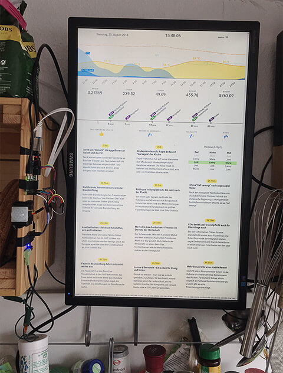

# wgschirm
displays interesting stuff while cooking and doing the dishes in your shared flat

<p align="center">
  
</p>

## Getting started
1. Setting up a config file is essential. The config consists of a `server` and `modules` object. Currently the server object holds only the part for the node server.
  ```{
    server: {
      port: 9999,
    },
    modules: {
      ...
    },
};
```
The modules object contains a key for each module. If a module's key is not present, the module won't be loaded when starting the server! Therefore a configuration for each module should be added. For the modules in this repo it should look like the following. Each module object has to have a valid `interval` or `schedule` key.
#### Interval
This module will be evoked with this interval (=> extern api will be called, e.g. weather api) and will forward the data to your dashboard.
#### Schedule
You can evoke a module with a schedule, e.g. every Monday with a Cronjob scheme. Just provide a valid schedule string. Data is forwarded on schedule.

### Weather
The weather module uses the darkskyapi. You need to provide a valid api key and coordinates of the weather location.
```
Weather: {
  interval: 60*5,
  key: '...',
  lat: '...',
  lng: '...',
  options: {
    exclude: ['minutely', 'daily', 'alerts'],
    language: 'auto',
    units: 'si'
  }
},
```
### Coins
The crypto module will call the bitstamp public api every 30s.
```
Coins: {
  interval: 30,
},
```
### Hvv
This is the local public transport company in Germany, Hamburg. If you want to use it, you have to get valid credentials to your their api. It will take up to 20 trains departing within the next 30 mins from a station (currently Hamburg, Altona) by default. This module is very speficic so use it as a tempalte to write one for your local public transport.
```
Hvv: {
  secret: '...',
  apiUrl: '...',
  apiUser: '...',
  interval: 60,
  num: 20,
  timeOffset: 30,
},
```
### News
The news modules uses the Tagesschau Rss Feed and parses the 11 most current items every 30s.
```
News: {
  interval: 30,
  nums: 11,
},
```
### OpenHours
This module will tell you if a restaurant is open, closed or is going to close soon via emojis. You need to provide a valid google places key and the places you want to know tghe opening times from.
```
OpenHours: {
  GOOGLE_PLACES_API_KEY: '...',
  interval: 18000,
  places: {
    'Restaurant Name': 'Gogole Place Id',
    ...
  },
},
```
### Cleaning
This module provides a cleaning schedule for your shared flat. Tasks is a string array of jobs which needs to be done. Workforce are participating humans. The 'empty' is just a placeholder, no function at the moment here. The duration desribes the duration of a schedule in weeks, e.g. duration=1 means every week a new taks, duration=2 every two weeks a new task.
```
Cleaning: {
  schedule: '30 0 0 * * 1',
  tasks: [ ... ],
  workforce: {
    'Human': 'empty',
    ...
  },
  duration: 1,
},

### Example
To write your own plugins just follow the examples in this project.
Example: {
  interval: 60000,
},
```

## todo
- documentation
- example module
